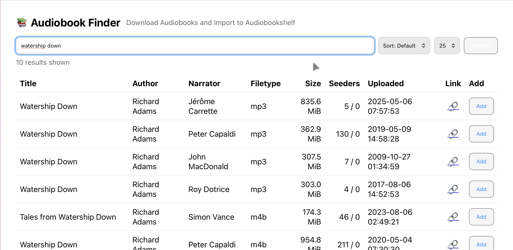
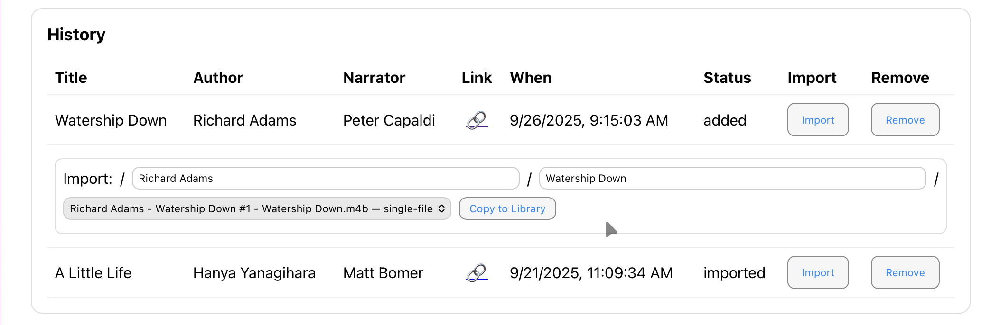

# MAM Audiobook Finder

A lightweight web app to search MyAnonamouse for audiobooks, add them to qBittorrent, and import completed downloads into your Audiobookshelf library.




## Features

- **Search MAM** - Find audiobooks by title, author, or narrator
- **Add to qBittorrent** - One-click torrent downloads
- **Import to Audiobookshelf** - Copy/link/move completed downloads to your library
- **Automatic Verification** - Confirms imports appear in Audiobookshelf
- **Library Indicators** - See which search results you already own
- **Showcase View** - Browse audiobooks in a visual grid grouped by title
- **Multi-disc Flattening** - Automatically reorganizes multi-disc audiobooks for Audiobookshelf
- **Download History** - Track all audiobooks you've added

## Quick Start

### 1. Clone & Configure

```bash
git clone https://github.com/magrhino/mam-audiofinder.git
cd mam-audiofinder
cp env.example .env
```

### 2. Edit `.env` File

**Required settings:**

```bash
# MAM session cookie (get from browser DevTools)
MAM_COOKIE=mam_id=your_cookie_here

# qBittorrent WebUI
QB_URL=http://qbittorrent:8080
QB_USER=youruser
QB_PASS=yourpass

# Storage paths (host paths)
MEDIA_ROOT=/path/to/media
DATA_DIR=/path/to/appdata/mam-audiofinder
```

**Optional - Enable Audiobookshelf features:**

```bash
# Enables cover images, import verification, library indicators
ABS_BASE_URL=http://audiobookshelf:13378
ABS_API_KEY=your_api_key_here
```

### 3. Start Container

```bash
docker compose up -d
```

### 4. Open Browser

Visit [http://localhost:8008](http://localhost:8008)

## Configuration

### Required Environment Variables

| Variable | Description | Example |
|----------|-------------|---------|
| `MAM_COOKIE` | Your MAM session cookie (use ASN-locked cookie) | `mam_id=abc123...` |
| `QB_URL` | qBittorrent WebUI URL | `http://qbittorrent:8080` |
| `QB_USER` | qBittorrent username | `admin` |
| `QB_PASS` | qBittorrent password | `password123` |
| `MEDIA_ROOT` | Host path containing both torrents and library | `/mnt/storage` |
| `DATA_DIR` | Host path for app data (databases, logs, covers) | `/path/to/appdata` |

### Optional - Audiobookshelf Integration

| Variable | Default | Description |
|----------|---------|-------------|
| `ABS_BASE_URL` | *(none)* | Audiobookshelf URL for cover images and verification |
| `ABS_API_KEY` | *(none)* | Audiobookshelf API token |
| `ABS_LIBRARY_ID` | *(none)* | Specific library ID to search (optional) |
| `ABS_CHECK_LIBRARY` | `true` | Show "already in library" indicators on search results |
| `MAX_COVERS_SIZE_MB` | `500` | Max disk space for cover cache (0 = no cache) |

**When ABS is configured, you get:**
- Cover images from your library (faster, no external requests)
- Automatic import verification (confirms audiobook appears in ABS)
- Library indicators (green checkmarks on search results you already own)
- Description display (pulled from Audiobookshelf metadata)

### Optional - Behavior

| Variable | Default | Description |
|----------|---------|-------------|
| `IMPORT_MODE` | `link` | Import method: `link` (hardlink), `copy`, or `move` |
| `FLATTEN_DISCS` | `true` | Flatten multi-disc audiobooks to sequential files |
| `QB_CATEGORY` | `mam-audiofinder` | Category assigned to new torrents |
| `QB_POSTIMPORT_CATEGORY` | *(none)* | Category to set after import (empty = remove category) |
| `APP_PORT` | `8008` | Host port for web interface |

### Optional - Container Settings

| Variable | Default | Description |
|----------|---------|-------------|
| `DL_DIR` | `/media/torrents` | In-container path for qBittorrent downloads |
| `LIB_DIR` | `/media/Books/Audiobooks` | In-container path for Audiobookshelf library |
| `PUID` | `1000` | Container user ID (for file permissions) |
| `PGID` | `1000` | Container group ID (for file permissions) |
| `UMASK` | `0002` | File creation mask |
| `LOG_MAX_MB` | `5` | Max log file size before rotation (MB) |
| `LOG_MAX_FILES` | `5` | Number of rotated log files to keep |

See `env.example` for full configuration with comments.

## How to Use

### Search for Audiobooks

1. Go to **Search** page (default)
2. Enter title, author, or narrator
3. Click **Search**
4. Results show with covers and "already in library" indicators (green checkmark)

### Add to qBittorrent

1. Click **Add** button on any search result
2. Torrent is added to qBittorrent with category `mam-audiofinder`
3. Entry is saved to **History** page

### Import to Audiobookshelf

1. Go to **History** page
2. Wait for torrent to complete downloading
3. Click **Import** button
4. Select torrent, enter destination path
5. If multi-disc detected: "Flatten" checkbox auto-checks
6. Click **Import**
7. Files are copied/linked to your library
8. Verification runs automatically (if ABS configured)
9. Status badge shows verification result: ✓ Verified, ⚠ Mismatch, ✗ Not Found

### Browse with Showcase View

1. Go to **Showcase** page
2. Enter search query
3. Results grouped by title in visual grid
4. Click any card to see all versions/editions
5. Add any version to qBittorrent from detail view

## Important Notes

### ⚠️ Security Warning

**This app has ZERO authentication.** Only run on:
- Private network behind VPN (Tailscale, WireGuard, etc.)
- Behind authenticated reverse proxy (Authelia, Authentik, etc.)
- Trusted local network with firewall

**NEVER expose to public internet.**

### Path Mapping

This app and qBittorrent run in separate containers. `MEDIA_ROOT` must be mounted to BOTH containers at consistent paths.

**Example docker-compose.yml:**

```yaml
services:
  mam-audiofinder:
    volumes:
      - /mnt/storage:/media  # MEDIA_ROOT

  qbittorrent:
    volumes:
      - /mnt/storage/torrents:/media/torrents
      - /mnt/storage/Books:/media/Books
```

**Container paths:**
- qBittorrent saves to: `/media/torrents/Book Title/`
- App imports from: `/media/torrents/Book Title/`
- App copies to: `/media/Books/Audiobooks/Book Title/`

If paths don't align, imports will fail with "path not found" errors.

### Multi-Disc Audiobooks

When `FLATTEN_DISCS=true` (default), multi-disc audiobooks are automatically reorganized:

**Before (multi-disc structure):**
```
Speaker for the Dead/
├── Disc 01/
│   ├── Track 01.mp3
│   └── Track 02.mp3
└── Disc 02/
    ├── Track 01.mp3
    └── Track 02.mp3
```

**After (flattened for Audiobookshelf):**
```
Speaker for the Dead/
├── Part 001.mp3
├── Part 002.mp3
├── Part 003.mp3
└── Part 004.mp3
```

This creates a clean, flat structure that Audiobookshelf can process as a single audiobook. Set `FLATTEN_DISCS=false` to preserve original structure.

### Import Verification

If Audiobookshelf is configured, imports are automatically verified:

- **✓ Verified** - Audiobook found in library with high confidence match (ASIN/ISBN or title+author)
- **⚠ Mismatch** - Possible match found but confidence is low (review manually)
- **✗ Not Found** - No matching audiobook found in library
- **? Unreachable** - Audiobookshelf not responding (check ABS_BASE_URL)

**Verification uses:**
1. ASIN/ISBN from metadata.json (highest priority)
2. Fuzzy title + author matching (fallback)
3. Retry logic: 3 attempts with exponential backoff

You can manually re-verify any import using the **🔄 Verify** button in History view.

## Troubleshooting

### Import fails with "path not found"

**Problem:** MEDIA_ROOT path mapping mismatch between containers

**Solution:**
1. Check qBittorrent save path matches `DL_DIR` in .env
2. Verify `MEDIA_ROOT` is mounted to both containers at same path
3. Run: `docker exec -it mam-audiofinder ls /media/torrents`
4. Run: `docker exec -it qbittorrent ls /downloads` (or wherever qB saves)

### Permission denied errors

**Problem:** Container user can't read/write files

**Solution:**
1. Check `PUID` and `PGID` match your host user: `id -u` and `id -g`
2. Verify `UMASK=0002` allows group write
3. Rebuild container after changing PUID/PGID: `docker compose up -d --build`
4. Check permissions: `docker exec -it mam-audiofinder ls -la /media`

### Covers not loading

**Problem:** Audiobookshelf not configured or unreachable

**Solution:**
1. Set `ABS_BASE_URL` and `ABS_API_KEY` in .env
2. Verify ABS is reachable: `docker exec -it mam-audiofinder curl http://audiobookshelf:13378`
3. Check API key is valid (test in ABS web UI settings)
4. Check logs: `docker compose logs -f mam-audiofinder`

### Verification always shows "not_found"

**Problem:** ABS hasn't scanned the library yet

**Solution:**
1. Wait 30-60 seconds for ABS to scan new import
2. Manually trigger library scan in ABS web UI
3. Click **🔄 Verify** button in History view to re-check
4. Check ABS logs for scan errors

### MAM searches fail

**Problem:** Invalid or expired MAM_COOKIE

**Solution:**
1. Get fresh cookie from browser (DevTools → Application → Cookies)
2. Use ASN-locked cookie (better security, longer expiry)
3. Update `MAM_COOKIE` in .env
4. Restart container: `docker compose up -d --force-recreate`

## Logs

View logs in browser: [http://localhost:8008/logs](http://localhost:8008/logs)

Or via command line:

```bash
# Real-time logs
docker compose logs -f

# Log files on host
cat <DATA_DIR>/logs/app.log
tail -f <DATA_DIR>/logs/app.log
```

Logs automatically rotate when reaching `LOG_MAX_MB` size (default 5MB).

## Technical Documentation

For developers, contributors, or those wanting to understand the internals:

- **[BACKEND.md](BACKEND.md)** - Backend architecture, database schemas, API endpoints, verification system
- **[FRONTEND.md](FRONTEND.md)** - Frontend architecture, components, views, styling
- **[CLAUDE.md](CLAUDE.md)** - AI assistant development guide

## Requirements

- Docker & Docker Compose
- qBittorrent with WebUI enabled
- Valid MAM session cookie
- (Optional) Audiobookshelf instance for covers and verification

## License

MIT - Provided as-is, no warranty.

This is a personal use tool. Not intended for production deployment or public access.
